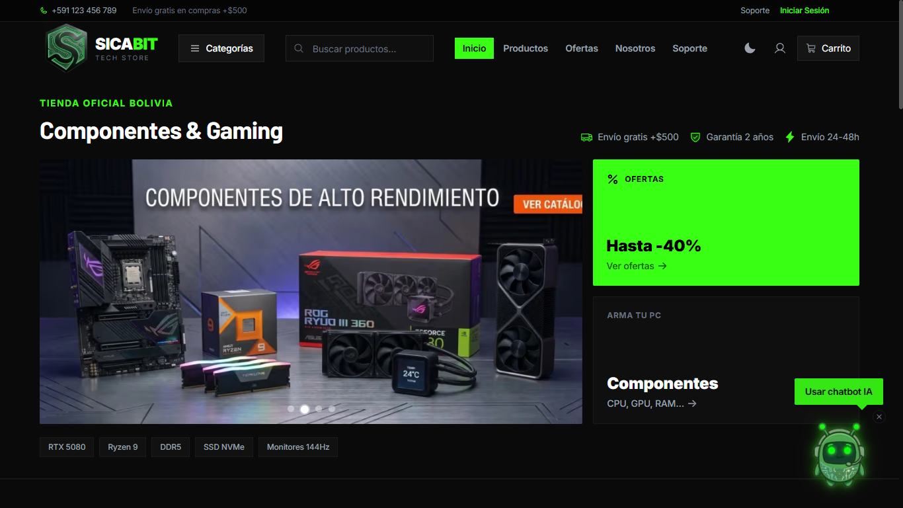

<div align="center">
  <h1>🛒 SicaBit - E-commerce Inteligente con Chatbot AI</h1>
  
  <p>
    <strong>Universidad Mayor, Real y Pontificia de San Francisco Xavier de Chuquisaca (USFX)</strong><br>
    <strong>Carrera de Informática</strong> • Sucre, Bolivia<br>
    <em>Proyecto de Grado — Modalidad: Monografía</em>
  </p>
  
  <p><strong>Autor / Postulante:</strong> David Bejarano</p>
</div>

---

<div align="center">
  
</div>

---

## 📖 Descripción Específica de la Monografía

**SicaBit** nace como propuesta de solución tecnológica en el marco de la investigación y desarrollo de una Monografía de Grado. La plataforma ilustra cómo integrar el comercio electrónico tradicional con las recientes innovaciones en **Inteligencia Artificial**, logrando así no solo una tienda en línea, sino una herramienta de autoservicio para los clientes finales a través de un **Chatbot con IA** basado en LLMs de última generación.

Esta arquitectura demuestra la aplicación de patrones de diseño de software modernos, infraestructuras escalables (contenedores), y seguridad robusta para defender tanto las transacciones como los datos de la plataforma.

---

## ✨ Características Destacadas

*   🤖 **Asistente Virtual (Chatbot IA):** El corazón de la investigación. Utiliza GROQ AI para guiar a los clientes, resolver consultas del catálogo en tiempo real y mejorar el nivel de resolución de ventas y soporte técnico.
*   🛍️ **Gestión Avanzada de Catálogo:** Navegación optimizada, soporte para marcas, categorías multinivel, revisión de stock detallada y reseñas verificadas.
*   🛒 **Flujo de Compra Seguro (Checkout):** Manejo dinámico de carrito de compras, direcciones de envío y validación de cupones promocionales integrados.
*   📊 **Panel Administrativo Administrativo:** Control CMS dedicado donde los dueños o gerentes pueden orquestar todo el comercio (productos, inventario, facturación y clientes).
*   🔒 **Seguridad y Criptografía:** El back-end valida sesiones mediante un robusto mecanismo de *Access Tokens y Refresh Tokens* (JWT) implementando sólidas capas de defensa.

---

## 🚀 Pila Tecnológica (Tech Stack)

El ecosistema se cimenta en una estructura de microservicios:

*   **Front-End:** [Next.js 14/15](https://nextjs.org/) (App Router), React, Tailwind CSS, TypeScript. Garantizando SSR y un SEO óptimo.
*   **Back-End (REST API):** [NestJS 11](https://nestjs.com/), TypeScript. Arquitectura modular y altamente escalable.
*   **Base de Datos & ORM:** [PostgreSQL 16](https://postgresql.org/) interactuando a través de [Prisma ORM 7](https://www.prisma.io/).
*   **Infraestructura y DevOps:** Orquestación y *containerization* completa con **Docker / Docker Compose**, gestionando proxies y certificados SSL gracias a **Nginx** y **Certbot** para asegurar un despliegue VPS fiable.

---

## ⚙️ ¿Cómo levantar la plataforma?

El proyecto cuenta con distintas metodologías para arrancar. Los entornos están estructurados para proteger el proceso *desarrollo* 👉 *producción*.

### Requisitos Base
- `Node.js` v20 o v22+
- `Docker` y `Docker Compose`
- Un gestor de paquetes (`npm` o `pnpm`)

---

### Entorno Local de Pruebas y Desarrollo (Sin Docker)
Para realizar debug directo sobre el código fuente de los repositorios.

1. **Base de Datos:** Inicializa o usa tu entorno local de PostgreSQL.
2. **Backend:**
   ```bash
   cd backend
   cp .env.example .env        # -> Ajustar base de datos y llaves JWT/Chatbot
   npm install
   npx prisma migrate dev      # -> Prepara las tablas
   npx prisma generate
   npm run start:dev
   ```
3. **Frontend:**
   ```bash
   cd frontend
   cp .env.local.example .env.local
   npm install
   npm run dev
   ```

---

### Local Test Rápido con Docker Compose
Evalúa y visualiza todo en 1 minuto gracias a Docker, levantando Base de datos, API y Cliente interconectados automáticamente.

```bash
# En la raíz del repositorio
cp .env.docker.local.example .env.docker.local
# Llenar la llave de tu ChatBot y contraseñas.

docker compose --env-file .env.docker.local up -d --build
# El frontend estará en http://localhost:3010
```

---

### 🌍 Despliegue en Producción (VPS Linux)

Si deseas visualizar el producto real accesible a nivel global (Ej. Océano Digital, AWS, Linode).

1. Clona el proyecto en tu servidor y apunta tu Dominio `DOMINIO.com` a la IP de la máquina (A Record).
2. **Variables Reales:**
   ```bash
   cp .env.docker.prod.example .env.docker.prod
   # => ¡CAMBIAR POR CONTRASEÑAS VERDADERAS, SECRETOS LARGOS DE JWT Y API KEYS!
   ```
3. **Inicializar Certificados HTTPS y Levantar Nginx/Docker:**
   ```bash
   chmod +x init-letsencrypt.sh
   sudo ./init-letsencrypt.sh
   ```
   *El script se encarga de crear proxies Nginx, negociar con Let's Encrypt por tus certificados SSL, y posteriormente orquestar el encendido completo del clúster.*

4. **Correr Esquemas:**
   ```bash
   # Configura las tablas en producción de forma segura
   docker compose -f docker-compose.prod.yml --env-file .env.docker.prod --profile migrate up migrate
   ```

---

## 👨‍💻 Notas Académicas

Este entorno cumple con las directrices estructuradas dentro de los márgenes académicos para la finalización de Grado en la gestión correspondiente. Todas las credenciales, llaves API expuestas en archivos `.example` sirven **únicamente como plantillas ilustrativas**, evitando filtrar información confidencial real.

<div align="center">
  <br>
  Hecho con pasión informática en USFX.<br>
</div>
